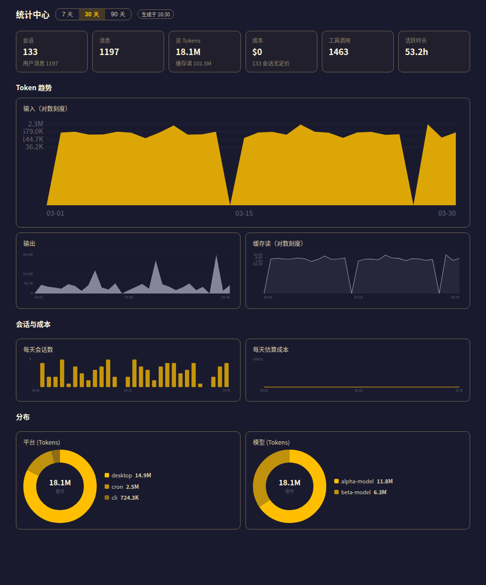

# hermes-stats · Stats Center for Hermes Desktop

[中文](README.md) | English

Add a data-rich stats center to Hermes Desktop: a **Stats** sidebar page, persistent statusbar chips, and a ⌘K entry point. Built entirely on the **official plugin mechanism** — zero core changes, **read-only** reuse of the official insights / dashboard analytics pipeline.

## Preview



> Preview uses synthetic data for illustration — not real usage.

## Features

| Area | What you get |
|---|---|
| 📄 Stats page `/stats` | Overview cards · Token trends (input/output/cache read) · Sessions & cost · Platform/model donuts · Model cost table · Top tools/skills · Activity patterns · Cron runs · System info |
| 🔋 Statusbar chips | `⚡ Today tokens · cost` (5-min refresh) + `📏 current session context usage` (10-sec live) |
| ⌘K | "Stats Center" command |
| 🔤 i18n | zh / en / zh-Hant / ja bundles, follows the app language |

## Token semantics

- Primary numbers = **input + output** (the tokens people usually mean)
- **Cache read is shown separately**, never folded into totals — under prompt caching it is re-read every turn and can dwarf everything else (typically 90%+ of the raw pipeline total)
- The **input** trend chart uses a **log scale** (usage spans hundreds-fold; a linear axis collapses to an outlier-dominated flat line); output has its own linear scale
- Cost `$0` means the model has no pricing data (data-source semantics, not a bug)
- **All costs are shown in CNY (¥)**: the analytics pipeline prices in USD (official model rates); the backend converts with a USD→CNY rate before serving
  - Rate sources: ECB reference rate (frankfurter.dev) → exchangerate-api fallback; cached 12h, and when the sources are unreachable the last known value is reused and labelled "缓存值"
  - The `FX 1 USD = ¥x.xxxx` tag next to the "Sessions & cost" heading shows the rate actually used; with no source and no cache it falls back to the built-in 7.10
  - A bank's FX selling rate differs from the ECB reference rate — this plugin uses the reference rate, for order-of-magnitude reading only

## Install

```bash
cd hermes-stats
cp -r plugin/. ~/.hermes/plugins/hermes-stats/        # note the trailing /. 
hermes config set plugins.enabled '["hermes-stats"]'  # enable the backend data endpoints
```

Then **restart Hermes Desktop** so the backend half (`/stats`, `/cron`, `/system`) mounts.

## Usage

After restart:

- Sidebar shows the **Stats** entry — or press ⌘K and type "Stats Center"
- Two chips appear at the right of the statusbar: `⚡ Today…` and `📏 ctx…` (click to jump to the page)
- On the page, switch the 7 / 30 / 90-day window, or hit "Refresh" for a manual update

## Toggling

- **Desktop half** (page / chips / ⌘K): Settings → Plugins panel — one toggle per plugin, **live, no restart needed**
- **Backend half** (`/stats`, `/cron`, `/system` endpoints): `config.yaml → plugins.enabled` — takes effect after a gateway restart

Fully disable = toggle off in the panel (immediate) + `hermes config set plugins.enabled '[]'` (next restart).

## Architecture

```
~/.hermes/plugins/hermes-stats/
├── dashboard/manifest.json     # plugin manifest (name + Python backend entry)
├── dashboard/plugin_api.py     # FastAPI endpoints /stats /cron /system (official stats fns, read-only)
└── desktop/plugin.js           # Electron renderer: page + statusbar chips + ⌘K + i18n
```

## Development

Plugin-developer oriented (regular installs can skip):

- `dev/hs-render-test/`: SSR smoke tests against real data — run `node smoke.mjs` before saving changes so pages break in the terminal, not the app
- `dev/preview/render-preview.mjs`: renders the README preview image (synthetic data, no real usage leaks)

Test scripts locate the runtime via `HERMES_HOME` / `HERMES_SRC` / `HS_PORT` / `HS_TOKEN` env vars — no code edits needed.

## Known limits

- Depends on the Hermes Desktop runtime plugin SDK; if the SDK changes behavior (e.g. `useQuery` is broken in this plugin runtime — this project works around it with a hand-rolled polling hook), the plugin needs to follow

## License

MIT — see [LICENSE](LICENSE)